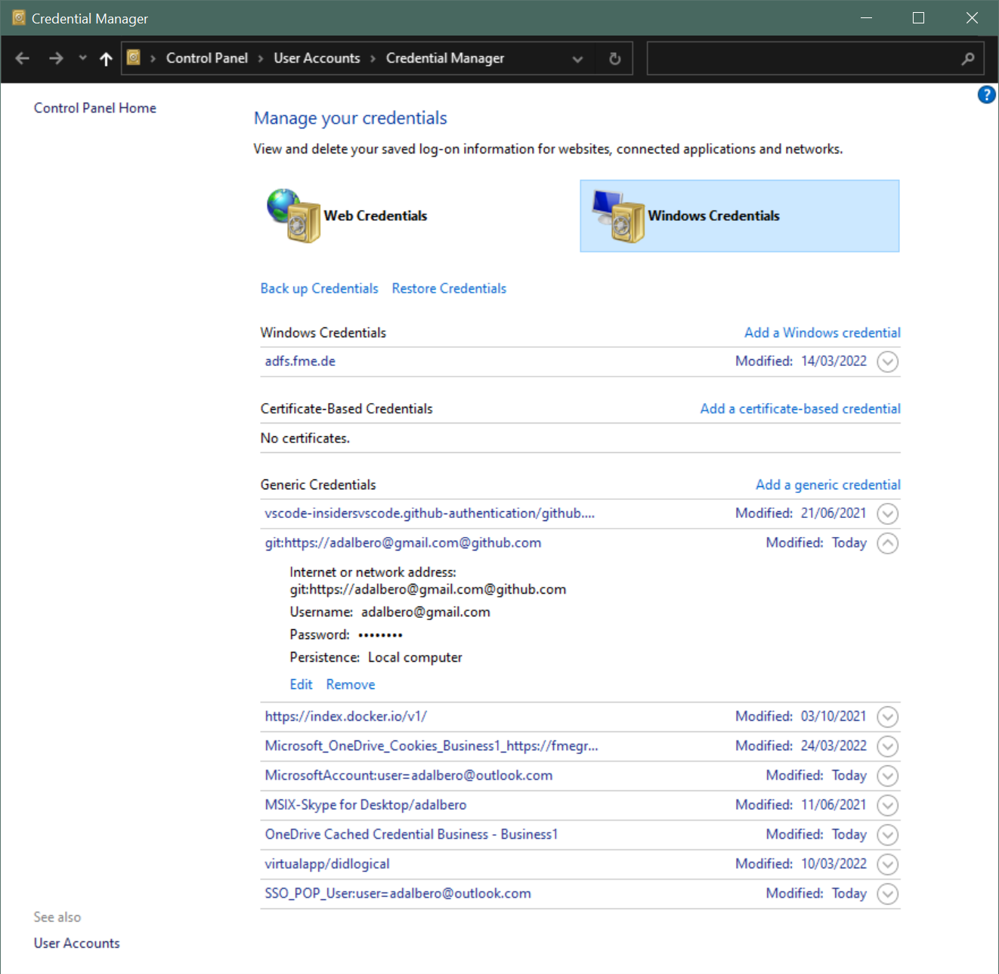

## Git - Credemtial

### How to reset password on Windows

1. Open Windows `Credential Manager`
2. Remove Generic Credential `git:https://...@github.com`

   

3. Next `push` or `pull` will ask for password

### How to generate a personal access token on GitHub

1. Open github.com
2. Open `Account / Settings / Developer / Personal access tokens`
3. Generate new token
